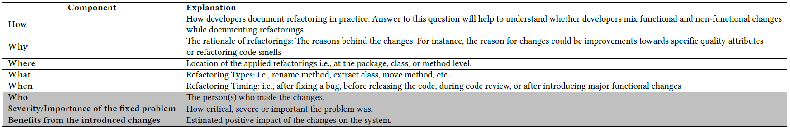

# 4W+H Model for Refactoring Documentation: A Practitioners' Perspective
This repository contains all material used in our paper entitle: " 4W+H Model for Refactoring Documentation: A Practitioners' Perspective". It includes the data of our quantitative analysis, the developers'anonymized survey answers and the final results. 

## Table of contents
* [Refactoring Documentation Model](#Rrefactoring-documentation-model)
* [Survey](#survey)
* [Quantitative Analysis](#quantitative-analysis)

## Refactoring Documentation Model
This following table represents tha refactoring documentation model reported by our interviwees. 

## Survey
#### Survey Design 
* The file of our survey questions is provided under the name : refactoringsurveyquestions.pdf
#### Participants Responses 
* We provide raw and processed data from our survey in files raw_survey_data.csv, processed_survey_data1.csv, processed_survey_data2.csv. 

## Quantitaive Analysis
#### Data Collection and Sampling
* Our collected refactoring-related commit messages data (the raw data) is found at: https://drive.google.com/open?id=1cdE43AhMjZUumVglR7Lr5eOk32-T3o-A
* Our filtered sample  of commit messages used in our manual inspection is found in the file quantitativeAnalysisData.csv in this directory. 
* Brief statistics about the studied projects in our sample : 
#### Manual Analysis of commit messages
* Our tagged data after the manual analysis is provided in the file named ManualTaggedData.csv. 

## Main highlights and results of the quantitative analysis is found at : 

