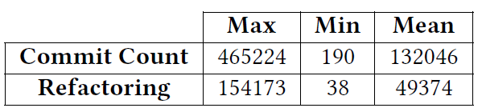

# 4W+H Model for Refactoring Documentation: A Practitioners' Perspective
This repository contains all material used in our paper entitle: " 4W+H Model for Refactoring Documentation: A Practitioners' Perspective". It includes the data of our quantitative analysis, the developers'anonymized survey answers and the final results. 

## Table of contents
* [Refactoring Documentation Model](#Refactoring-documentation-model)
* [Survey](#survey)
* [Quantitative Analysis](#quantitative-analysis)

## Refactoring Documentation Model
This following table represents tha refactoring documentation model reported by our interviwees. 

## Survey
#### Survey Design 
* The file of our survey questions is provided here: [Survey Questions](./surveyQuestions.pdf)
#### Participants Responses 
* We provide the extracted data from our survey as following:
      *[Raw Survey data](./Refactoring Documentation.csv)
      *[Survey data part one](./SurveyResults-secI&II.csv)
      *[Survey data part one](./SurveyResults-secI&II.csv)
## Quantitaive Analysis
#### Data Collection and Sampling
* Our collected refactoring-related commit messages data (the raw data) is found at: https://drive.google.com/open?id=1cdE43AhMjZUumVglR7Lr5eOk32-T3o-A
* Our filtered sample  of commit messages used in our manual inspection here : [Sample of commit messages for manual inspection](./QuantitativeAnalysisData.csv)
* Brief statistics about the studied projects in our sample : 

#### Manual Analysis of commit messages
* Our tagged data after the manual analysis is provided here :  [Manual tagged data](./resultsQuantitativeAnalysis.csv)

## Visualizations and main results of our study can be found at: https://sites.google.com/view/fse20206refactoringdoc/home

